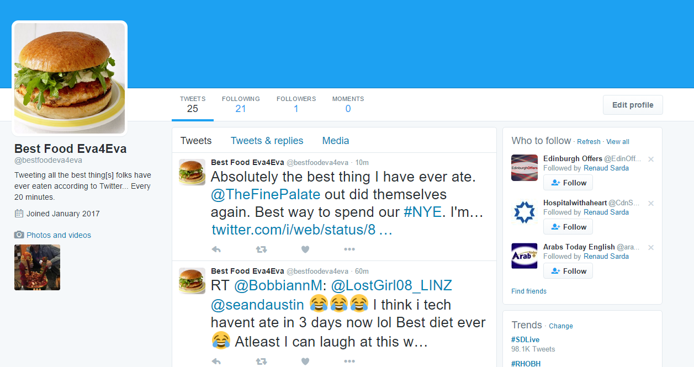

# Best-Thing-Ever-Eaten-Tweets

This project was a quick, live-coded session to build a Twitter bot using Node.js and Heroku. The running application searches for the phrase: "Best thing I ever ate" on Twitter and randomly selects a new tweet every 20 minutes. 

See it live: https://twitter.com/bestfoodeva4eva

Watch the Code Through Video: https://www.youtube.com/watch?v=FQEjree-Hjg&index=1&list=PLgJ8UgkiorCnh8hGydI17pWyaE3l9c1TK

